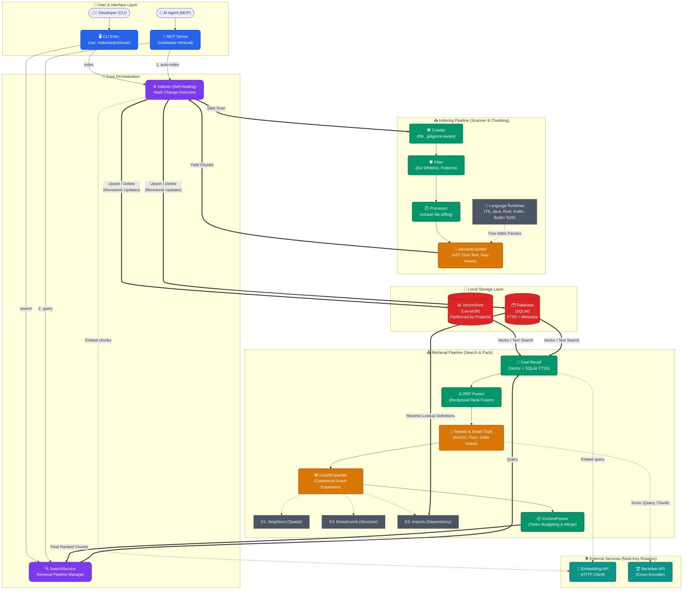

# 🧠 ACE Architecture

> **ACE** 是一个专为 AI 代码助手设计的语义检索引擎，结合了混合检索、上下文图扩展以及精确的 Token 打包控制策略。

以下是高度浓缩的核心架构流程图，展示了从索引构建到检索分析的完整生命周期。

## 🏗️ 核心架构图 (Core Pipeline)

## 🔑 核心模块解析

### 1. **Scanner 智能增量扫描**
* 结合 `fdir` 和快速 `xxhash` 算法，在秒级对比文件的增、删、改。
* **自愈更新 (Self-healing)**：`Indexer` 使用“先插新后删旧”的单调更新策略，杜绝索引黑洞。

### 2. **Semantic Splitter 语义分块**
* 基于 Tree-sitter 可插拔架构实现代码解析。
* 创新的 **Dual-Text** 与 **Gap-Aware** 机制确保分块既保证语义完整，又不丢失中间状态。

### 3. **Smart TopK 截断控制**
位于 Rerank 层与扩展层之间，为抵御劣质 Chunk 刷屏提供了多重防线：
* **Anchor & Floor**: 设定双下限（下限基准 + 比率门槛）。
* **Delta Guard**: 避免最高分与后续分数的异常断层。
* **Safe Harbor / Hard Cap**: 提供安全港兜底以及最高 Token 总量熔断机制。

### 4. **GraphExpander 图扩展策略**
检索不仅限于单一切片，而是向外延伸出 3 个维度的附带上下文：
* `E1 邻居扩展`：代码物理位置上的相邻切片（上/下文）。
* `E2 面包屑补全`：逻辑前缀匹配补充（如类名/命名空间结构）。
* `E3 Import 依赖扩展`：跨文件的跨依赖定义解析。

> [!TIP]
> **日常排查与优化**
> 您可以使用 `ace doctor . --repair` 随时审计与自愈索引状态；或者使用 `ace tune <dataset>` 基于离线反馈数据自动调参，寻找最佳的 RRF/TopK 超参组合。
